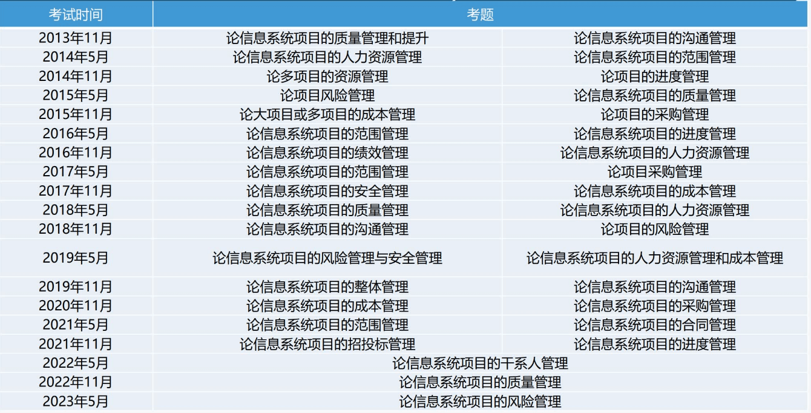

- 1.论文
  collapsed:: true
	- 掌握论文基本要求
	- 框架+基础
	- 10大管理+八大绩效域
		- 大家对于10大管理要把握这样一个规律:
			- (1)每个管理的过程是什么?
			- (2)每个子过程的输入、输出、工具和技术是什么?
			- (3)每个管理领域可能会出现什么问题，应该怎么解决？
			- (4)每个管理和其余管理的联系是什么?
- 2.论文评分
  collapsed:: true
	- 切合题意
	- 理论+实际
- 3.万能模板
  collapsed:: true
	- 1.背景 500字左右
		- {:height 97, :width 654}
	- 2.过渡 100-150字
		- {:height 68, :width 659}
	- 3.子题目
		- 理论+实际
		- 一个过程是一段
		- 如果子题目提到图表必须要画图表
		- 认真学习基础，基础知识在这里体现，也是论文过不过的关键
	- 4.结尾 300-350字左右
	  collapsed:: true
		- 项目成功+不足之处+表决心
			- 项目中常见的一些问题总结
				- 1、核心人员离职
				- 2、客户需求一变再变
				- 3、团队成员争吵
				- 4、进度稍微滞后了
				- 5、成本稍微超支
				- 6、采购的货物没有及时送来
				- 7、没有良好的配置管理
				- 8、与项目支持者、参与者缺少沟通
				- 9、可能采用了一些用户不熟悉的技术，对用户抵触心理认识不足
				- 10、风险评估过于随意
				- 11、对项目动态缺乏了解，因此要及时的监控
				- 12、信息严重不对称，可以引入监理机制，或者是加强培训
				- 13、质量部分不合乎用户要求
				- 14、市面上突然出现了新的产品或是技术、方案等
		- {:height 150, :width 654}
- 4.历年论文考试题目
  collapsed:: true
	- 
	- 
	- 
	- 
- 5.项目素材
  collapsed:: true
	- 可以利用AI或招标网找项目背景
	- 为进一步加强XX主城区静态交通管理，规范机动车停车秩序，提高停车泊位的利用率，xx区积极推进智慧停车项目建设，现已正式投入使用。今年以来，XX区抢抓新机遇，积极构建智慧城市全面感知网络，力求缓解长期困扰群众的停车难问题。一方面设立9块停车诱导屏，实时采集、传输，发布重点区域停车场、停车位空余信息，为进入本辖区的出行者提供全方位的停车诱导信息服务，实现停车数据全面联网、动态信息实时发布、市民停车精准指引。另一方面，通过地磁传感技术、无线通信技术、物联网技术等数字化手段，对xx区公共停车资源进行统一管理，结合“XXX智慧停车”微信小程序，让驾驶者借助诱导系统，实现泊位服务信息化、停车管理规范化、市民停车便捷化，有效缓解主城区停车难问题。机动车泊位通过高低位相机、地磁感应技术及巡检车巡检等方式，对车辆进行管理和收费。停车收费工作启动后，通过价格杠杆作用，逐步提升停车泊位使用周转率，缓解主城区居民停车难题。