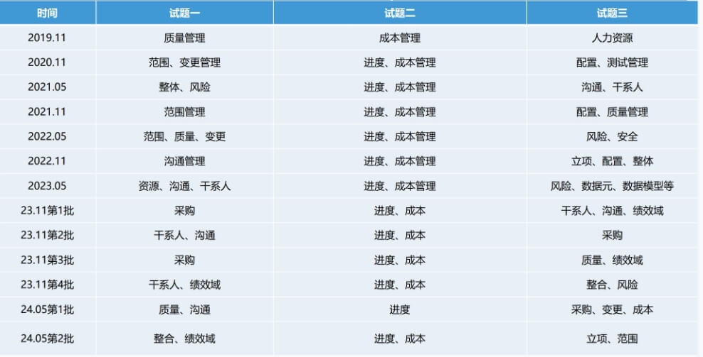

- 案例分析
  collapsed:: true
	- 3个题目满分75分
	- 宏观角度
		- 计算、找错改错、纯理论
	- 微观角度
		- 问答、计算、填空、判断、连线、选择
- 案例技巧
  collapsed:: true
	- (1)由于是机考，请大家注意按机考系统的要求来，在指定地方作答
	- (2)考题中可能有画图，请大家务必熟悉机考系统的画图工具，建议先用笔画图，然后再画到机考系统里。
	- (3)关于案例考试的总结资料还是要多读多看的。
	- (4)`审题`很重要，考题给定资料要逐词逐句读，基本上每句对应1-2个考点
	- (5)`答题`的时候`分点写`，每点写一句，因为按点给分，尽可能多罗列写点。
	- (6)`计算题一定要算对`，考前把每年的真题做一遍。
	- (7)`首先看题目时先浏览一下大概考的是属于十大管理的哪一个管理，在草稿纸上列出该管理的几大过程
	  看案例中是否有遗漏或做错的过程。`
	- (8)十大管理结合起来答题，比如考变更管理的题，我就想变更没有做好，那跟项目整合管理、沟通管理合同管理都有关系，结合给定资料具体分析，尽可能多的联想。
	- (9)答完必答的部分，如果还有空间，充分发挥你的联想力，把案例中觉得不够完善的需要补充的环节全部写上。
	- (10)案例历年真题要全部过一遍，`计算题要自己做`，问答题直接看答案。
	- (11)文字要简练，不要长篇大论，不要有太多的修饰词，以免浪费时间。
	- (12)在计算的时候，要写出公式，即使计算错了，也会给大部分分数。
	- (13)建议大家采用比较专业的术语进行答题，让老师知道您对知识的掌握情况。
	- (14)纯理论题对99%的考生都有难度，建议不要太过于担心，先把计算题和找错题尽力多得分
	- (15)纯理论题，平时把一些非常重要的考点多读多读，能用自己的话尽力描述一些出来就好。
- 备考优先级
	- 计算题 > 找错改错 > 理论题
- 
- _1732498387597_0.jpg){:height 387, :width 780}